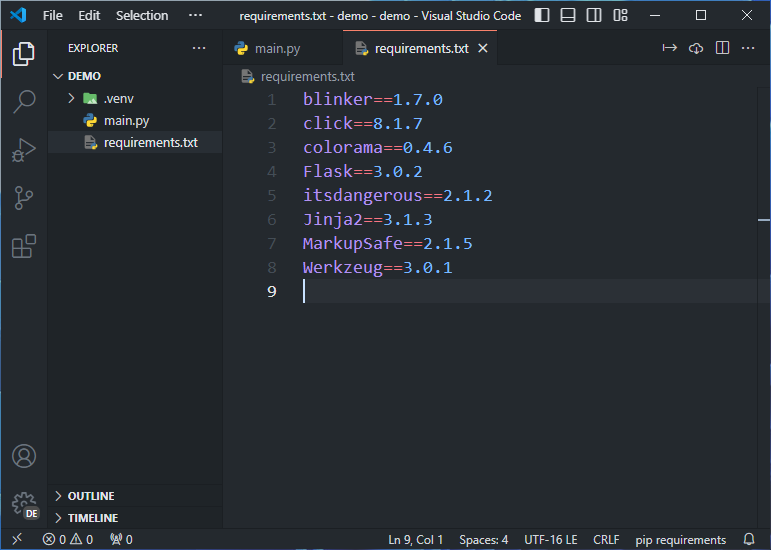
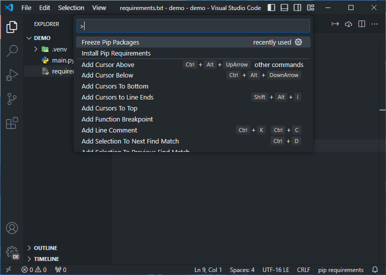

# Pip Requirements

This useless extension gives you some tools for the requirements.txt file

## Taskbar

It adds the buttons for `pip freeze` and `pip install -r` to the taskbar of the requirements file

## Command Pallete

You can also use these commands from the Command Pallete and enter the path to your file manually

## Settings

You can configure if the input field of these commands should ignore when you move your focus from it